# 교직원 연수 등록부 도우미 · 교사용 매뉴얼

**대상: 학교 설치·운영 담당자와 서명 참여자**

기준 버전: 화면·GAS **v5.2.1** · 화면 확인일 **2026년 10월 10일**

학교의 Google Apps Script(GAS)와 Google Drive에서 운영합니다. 일반 교직원은 배포받은 QR로 서명하며 관리자 계정이나 Vercel 계정이 필요하지 않습니다.

**이 매뉴얼의 예시 아이디·파일 ID·QR은 실제 접속 정보가 아닙니다. 본인 학교의 값을 사용하세요.** Google 메뉴 사진은 실제 한국어 Apps Script 화면을 촬영했습니다. 프로그램 화면은 동일한 v5.2.1 코드를 가상 학교에서 실행한 예시입니다. 실제 학교 명단·서명·연결키·계정 주소는 포함하지 않습니다. Google 화면은 계정 종류와 언어에 따라 달라질 수 있습니다.

- [최신 GAS 설치 파일](https://github.com/skonT151216/teachersign-improved/releases/latest/download/TeacherSign-GAS.zip)
- [자료 이전 6단계 · 바로 읽기](https://github.com/skonT151216/teachersign-improved/blob/main/docs/자료이전_핵심안내.md) · [한 장 PDF 다운로드](https://github.com/skonT151216/teachersign-improved/releases/latest/download/TeacherSign-Migration-Quick.pdf)
- [인쇄용 PDF](https://github.com/skonT151216/teachersign-improved/releases/latest/download/TeacherSign-Manual.pdf)
- [인터넷 없이 열 수 있는 매뉴얼 ZIP](https://github.com/skonT151216/teachersign-improved/releases/latest/download/TeacherSign-Manual.zip)

## 1. 가장 먼저: 내 학교에 맞는 절차 고르기

| 현재 상황 | 시작할 곳 | 할 일 |
| --- | --- | --- |
| 이 프로그램을 처음 설치하는 학교 | 2 → 3 → 4 → 5 → 6 → 7 | 코드 설치, 학교 관리자 계정 생성, 연수·QR 시험 |
| v4에서 기존 연수·서명을 사용하던 학교 | 8 | 원본 확인, 한 번 자료 이전, 기존 배포 갱신 |
| 이미 v5에서 자료를 정상 사용 중인 학교 | 10 → 9 | 같은 프로젝트의 두 파일 교체와 기존 배포 갱신 |
| 서명만 할 교직원 | 7 | 담당자가 배부한 QR로 접속 |
| 공용 도메인으로 접속할 담당자 | 위 학교 절차 후 11 | 본인 학교의 /exec 주소 연결 |

**v4 사용 학교는 ‘새 설치’만 하고 끝내면 안 됩니다.** 새 빈 저장소가 표시될 수 있습니다. 8번의 여섯 단계만 따라 하세요. 이미 업데이트했는데 빈 화면이 뜬 경우도 같은 절차로 확인합니다.

**이전은 v4 → v5 최초 한 번입니다. 이후 동일 v5 프로젝트를 업데이트할 때는 다시 이전하지 않습니다.**

## 2. Code.gs와 Index.html 설치·교체

1. 최신 **TeacherSign-GAS.zip**을 다운로드하여 압축을 풉니다. 웹페이지에 보이는 일부 코드만 복사하지 말고 압축파일의 내용을 사용합니다.
2. [Apps Script](https://script.google.com)에 학교 운영용 Google 계정으로 로그인합니다. 처음 설치할 때만 **새 프로젝트**를 만듭니다. 기존 학교는 사용 중인 프로젝트를 엽니다.
3. 왼쪽 **Code.gs**를 클릭합니다. 편집기 안을 클릭하고 전체 선택한 뒤, ZIP의 **Code.gs 전체 내용**으로 교체합니다. Mac은 ⌘A / ⌘V, Windows는 Ctrl+A / Ctrl+V입니다.
4. **Index.html**이 있으면 내용을 전체 교체합니다. 없으면 아래 사진의 **파일 옆 + → HTML**을 눌러 이름을 **Index**로 입력합니다. ZIP의 **Index.html 전체 내용**을 붙여넣습니다.
5. 상단 저장 아이콘 또는 ⌘S / Ctrl+S로 저장합니다. 저장이 끝난 뒤 함수 목록을 확인합니다.

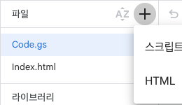

**사진에서 누를 곳: + → HTML. 파일 이름은 대문자 I로 시작하는 Index입니다.** Google이 .html을 붙여 주므로 이름 입력창에는 Index만 입력합니다.

**정상 결과:** 왼쪽에 Code.gs와 Index.html 두 파일이 있고, 상단에서 setupTeacherSign을 선택할 수 있습니다. 최신 코드에는 8번의 자료 이전 함수도 있습니다.

기존 스크립트 속성, Google Drive 파일, 관리자 계정은 삭제하지 않습니다. ZIP의 appsscript.json은 매니페스트를 직접 관리하는 경우 사용하는 파일입니다. oauthScopes를 직접 지정한 기존 프로젝트는 최신 매니페스트도 반영합니다. 자동 권한 설정을 사용한다면 별도 편집 없이 진행할 수 있습니다.

## 3. 설치 함수 실행과 Google 권한 승인

1. 설치 담당자 본인이 만든 학교 프로젝트의 편집기에서 상단 함수 목록을 엽니다.
2. **setupTeacherSign**을 선택하고 **실행**을 누릅니다. 이름 끝에 밑줄이 없습니다.
3. 권한 승인이 나오면 **권한 검토**를 누르고 학교 자료를 보관할 계정을 선택합니다. Drive·Sheets·설치 계정 확인 권한을 확인하고 허용합니다.
4. **실행 로그**를 열어 실행 완료와 **관리자 연결키**를 확인합니다. 연결키는 담당자만 보관합니다.

**사진에서 누를 곳: setupTeacherSign 함수 선택 → 실행 → 실행 로그.** 자료 이전 함수도 같은 목록에서 선택해 실행합니다. 현재 선택한 함수 이름을 확인하고 실행하세요.

**정상 결과:** 실행이 완료되고 학교 전용 저장 폴더가 준비됩니다. 새 학교는 연결키를 4번의 최초 설정에 사용합니다. 기존 관리자 계정이 있는 학교는 다시 계정을 만들지 않습니다.

Google이 ‘확인되지 않은 앱’ 경고를 표시할 수 있습니다. 방금 공식 저장소의 코드를 본인 학교 프로젝트에 넣은 상황인지 확인하고, 계정·권한 내용을 확인하여 진행합니다. 신뢰할 수 없는 다른 프로젝트의 경고에서는 진행하지 않습니다. 학교 정책이 권한 승인을 차단하면 학교 Google Workspace 관리자에게 문의합니다.

**함수가 없다면:** 두 파일의 내용을 전부 넣었는지, 저장이 완료되었는지 확인하고 편집기를 새로고침합니다. setupTeacherSign_만 찾는 경우 최신 Code.gs인지 확인합니다. 기존 파일이나 속성을 지워 해결하려고 하지 않습니다.

## 4. 처음 설치한 학교: 웹앱 배포와 계정 생성

1. 오른쪽 위 **배포 → 새 배포**를 선택합니다. **유형 선택 옆 톱니바퀴 → 웹 앱**을 선택합니다.
2. **다음 사용자 인증 정보로 실행: 나**를 선택합니다. **액세스 권한이 있는 사용자: 모든 사용자**로 설정하고 배포합니다. ‘Google 계정이 있는 사용자’와 구분하세요.
3. 발급된 **웹 앱 URL의 /exec 주소**를 복사하여 엽니다. 편집기 주소나 /dev 주소를 학교 접속 주소로 배포하지 않습니다.
4. ‘학교 관리자 최초 설정’에서 학교 이름, 3번에서 받은 연결키, 직접 정할 관리자 아이디와 암호를 입력합니다. 암호는 12자 이상이며 확인란과 같아야 합니다.
5. **학교 관리자 계정 만들기**를 눌러 완료합니다. 이후에는 방금 정한 아이디·암호로 로그인합니다.

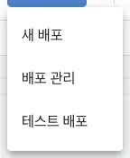

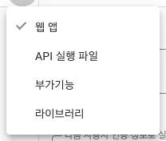

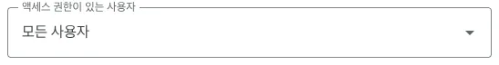

**정상 결과:** 새 학교에서는 최초 설정 화면이, 계정이 이미 있는 학교에서는 로그인 화면이 열립니다. 고정된 공통 기본 아이디·비밀번호는 없습니다. 연결키는 로그인 암호가 아닙니다.

Google 로그인 없이 참여하도록 ‘모든 사용자’를 선택해야 합니다. 해당 선택지가 없거나 공개 배포가 차단되면 학교의 Workspace 정책을 확인합니다. 이 경우 로그인 없는 서명이 준비된 것으로 안내하지 않습니다.

## 5. 최초 설정 화면의 입력 위치

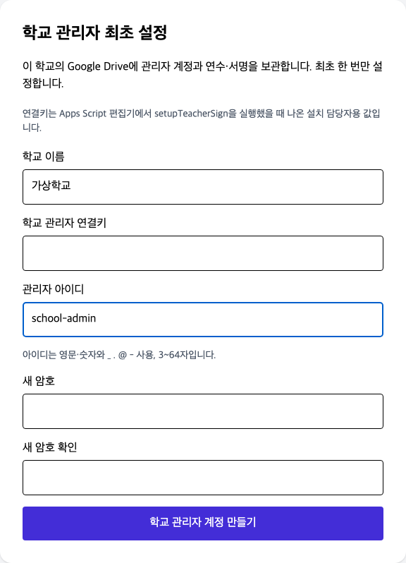

**위 사진은 입력 위치를 보여 주는 예시입니다. school-admin은 학교가 정할 아이디의 예이며 공통 계정이 아닙니다.** 연결키와 암호는 사진에 입력하지 않았습니다. 학교 이름·연결키·아이디·암호·암호 확인을 채운 뒤 맨 아래 버튼을 누릅니다.

**이미 v5 관리자 계정이 있다면:** 최초 설정 대신 로그인 화면을 사용합니다. 10번의 일반 업데이트로 계정은 유지됩니다. v4에서 처음 전환하는 경우에는 v5 학교 관리자 계정을 한 번 생성해야 할 수 있습니다.

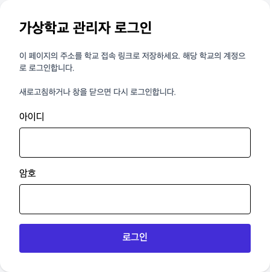

## 6. 담당자: 명단 등록과 QR 공유

1. 학교 관리자 아이디·암호로 로그인합니다. **관리자 대시보드**가 열리는지 확인합니다.
2. **교직원 명단 관리(학교용) → 양식 다운로드**로 Excel 양식을 받습니다. 가상 이름 한 명으로 먼저 시험한 뒤, 양식의 열 제목을 유지한 채 실제 명단을 작성하고 **명단 업로드(Excel)**로 올립니다.
3. **새 연수 등록 → 학교용**에서 연수명·기관명·날짜 등을 입력하고 **연수 등록**을 누릅니다. 학교용 연수는 등록된 교직원 명단이 필요합니다.
4. 등록된 연수 카드의 **링크 공유**를 눌러 QR과 참여자 링크를 확인합니다. 관리자 로그인 페이지 주소만 보내면 서명 화면으로 바로 들어갈 수 없습니다.
5. 휴대폰의 시크릿/비공개 창에서 QR 참여자 링크를 열어 로그인 없이 서명되는지 시험합니다. 관리자 화면에서 해당 연수의 서명과 내보내기를 확인합니다.

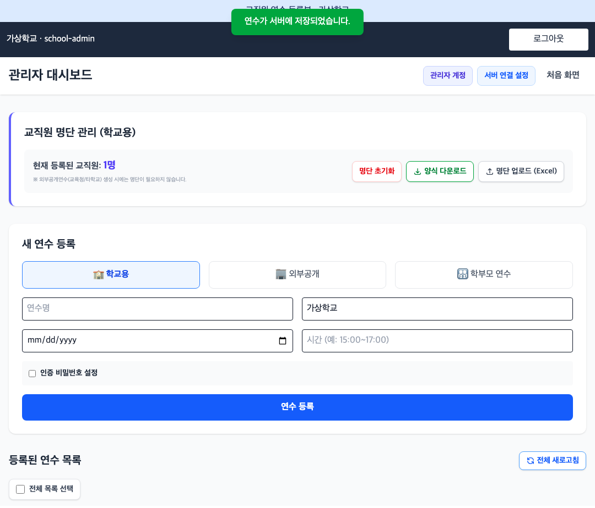

**사진의 등록 교직원 1명은 예시입니다.** 외부공개·학부모 연수는 학교용과 입력 방식이 다릅니다. 실제 운영 유형을 선택하세요. QR은 연수별로 발급하며 연수 인증 비밀번호를 설정했다면 참여자에게 별도로 안내합니다.

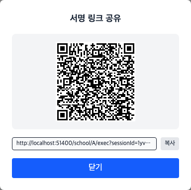

**위 QR과 localhost 주소는 촬영용 예시입니다. 스캔하거나 배포하지 마세요.** 학교의 실제 연수에서 링크 공유를 눌러 나온 QR과 주소를 사용합니다.

**정상 결과:** 등록한 연수가 목록에 있고 링크 공유에서 그 연수의 QR이 나옵니다. 새로고침 후 다시 로그인해도 연수와 명단이 남아 있습니다.

## 7. 참여 교직원: QR로 서명하기

1. 담당자가 배부한 **해당 연수의 QR**을 휴대폰으로 읽거나 참여자 링크를 엽니다.
2. 학교용 연수에서는 **본인 이름**을 선택합니다. 외부공개·학부모 연수에서는 화면이 요구하는 항목을 입력합니다. 연수 인증 비밀번호를 설정한 연수는 그 비밀번호를 입력합니다.
3. 서명 칸에 손가락으로 서명하고 **서명 완료**를 누릅니다. 화면에 서명완료 표시가 나타나는지 확인합니다.
4. Google/Vercel 로그인이나 학교 관리자 암호를 요구하는 화면으로 들어갔다면 담당자에게 해당 연수의 새 QR을 요청합니다.

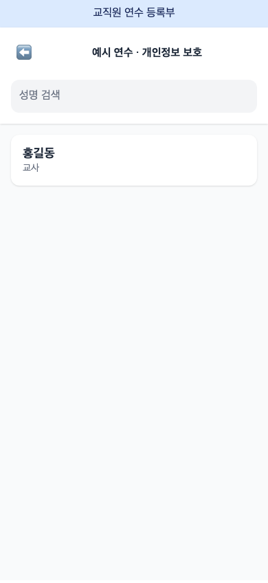

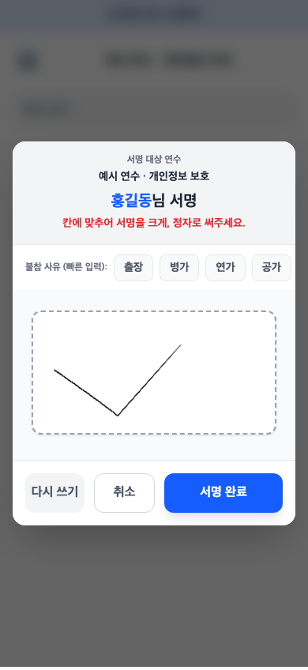

**사진은 가상 이름과 예시 서명입니다. 본인 이름을 선택하세요.** 출장·병가 등의 항목은 해당 상황에 맞을 때 사용합니다. 정상 참여자는 관리자 로그인 없이 서명합니다.

**완료 확인:** 본인 이름 옆의 **서명완료** 표시를 확인합니다. 전송이 끝나기 전에 탭을 닫지 않습니다. 담당자는 관리자 화면에서 실제 서명 이미지를 확인할 수 있습니다.

## 8. v4 자료 이전: 이 순서대로만 따라 하세요

**기존 v4 자료를 v5로 옮길 때 한 번만 합니다. 이미 v5에서 자료가 잘 보이면 건너뛰세요.** 시작 전 기존 코드·자료의 사본을 보관하고, 이전이 끝날 때까지 새 연수·서명 입력을 잠시 멈춥니다.

1. **Google Drive에서 기존 자료 파일을 먼저 찾습니다.** TrainingApp_DB.json과 TrainingApp_Signatures의 **공유 → 링크 복사**를 누릅니다. 링크의 `/d/` 다음부터 다음 `/` 앞까지가 **파일 ID**입니다. 공유 권한은 바꾸지 않습니다.
2. **기존 Apps Script 프로젝트를 엽니다.** 최신 ZIP의 Code.gs와 Index.html 내용으로 교체하고 저장합니다. 파일을 넣는 위치는 2번 사진을 참고하세요. 새 프로젝트를 만들 필요는 없습니다.
3. **상단 함수 목록에서 setupTeacherSign → 실행**을 누릅니다. 권한 창이 나오면 학교 자료를 보관한 Google 계정으로 승인합니다.

4. **Apps Script 왼쪽 톱니바퀴 → 스크립트 속성 수정 → 스크립트 속성 추가**로 아래 두 줄을 넣고 **스크립트 속성 저장**을 누릅니다. 기존에 있는 다른 값은 그대로 둡니다.

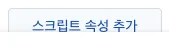

| 속성 칸에 복사해서 넣을 이름 | 값 칸에 넣을 것 |
| --- | --- |
| TEACHERSIGN_LEGACY_DB_FILE_ID | 기존 TrainingApp_DB.json의 파일 ID |
| TEACHERSIGN_LEGACY_SIGNATURE_FILE_ID | 기존 TrainingApp_Signatures의 파일 ID |

**별도 서명 시트를 쓰지 않았고 모든 서명이 JSON에 있는 것이 확실할 때만** 둘째 값에 `NONE`을 넣습니다. 파일이 여럿이거나 원본이 불확실하면 임의로 고르지 말고 도움을 요청하세요.

5. **왼쪽 편집기 → 상단 함수 목록에서 previewTeacherSignMigration → 실행**을 누릅니다. **실행 로그**의 `source` 안 `sessions`가 기존 연수 개수와 맞고 **이전 사전 확인 완료**가 나오는지 확인합니다. 예: `"sessions":23`이면 연수 23개입니다. 서명 개수도 비교합니다.
6. 맞으면 **migrateTeacherSignLegacyData → 실행**을 누릅니다. **이전 완료**가 나오면 **배포 → 배포 관리 → 사용 중인 웹앱 → 연필 → 새 버전 → 배포**를 누릅니다. 사이트를 새로고침해 기존 연수·서명을 확인하고 QR을 다시 발급합니다. 배포 화면은 9번 사진을 참고하세요.

**백업·자료 복사·연결 변경은 도구가 처리합니다. 오류가 나오면 중단하고 오류 문구를 전달하세요. 해결하려고 기존 자료를 지우거나 이전을 반복하지 않습니다.** 최초 설정 화면이 뜨면 5번처럼 관리자 계정을 만든 뒤 로그인합니다.

[막혔을 때만 자세한 이전 안내 보기](https://github.com/skonT151216/teachersign-improved/blob/main/gas/standalone/v4자료이전.md)

## 9. 기존 /exec 주소를 유지하며 배포 갱신

1. 최신 Code.gs와 Index HTML 저장을 마친 뒤 **배포 → 배포 관리**를 엽니다.
2. 활성 배포 중 **현재 학교에서 사용 중인 /exec 주소와 일치하는 웹앱**을 선택합니다. 제목이 같은 배포가 여럿이면 웹 앱 URL을 비교합니다.
3. 오른쪽 위 **수정(연필 아이콘)**을 누릅니다. **버전** 목록에서 맨 위 **새 버전**을 선택합니다. 버전 숫자는 학교마다 다릅니다.
4. 실행 사용자 **나**, 액세스 **모든 사용자**를 확인하고 설명에 업데이트 내용을 적은 뒤 **배포**를 누릅니다.
5. 기존 /exec 주소를 다시 열어 새 화면이 뜨는지 확인합니다. 학교 접속 URL을 유지했는지 비교합니다.

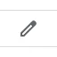

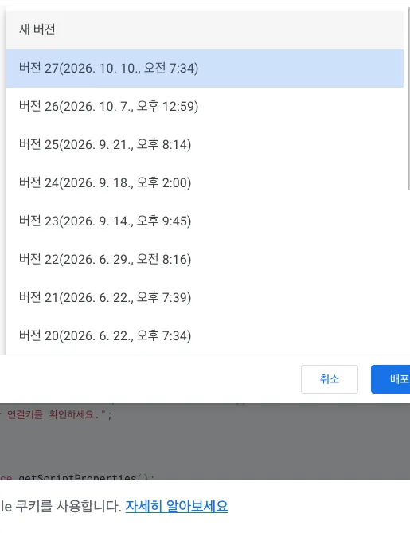

**정상 결과:** 같은 웹앱 URL로 새 버전이 제공됩니다. 코드 저장만으로 기존 /exec의 배포 버전이 바뀌지는 않습니다. ‘새 배포’를 만들면 주소가 달라질 수 있으므로 기존 학교의 갱신에는 ‘배포 관리’를 사용합니다.

Google의 배포 버전 번호(예: 버전 27)와 프로그램 버전(예: v5.2.1)은 다른 값입니다. 프로그램 버전은 로그인 후 10번의 업데이트 화면에서 확인합니다.

## 10. 이미 v5를 쓰는 학교: 일반 업데이트

1. 관리자 로그인 후 상단 **서버 연결 설정 → 프로그램 업데이트**를 엽니다. 현재 화면·학교 GAS·GitHub 최신 버전을 비교합니다.
2. 업데이트가 있으면 **GAS 설치 ZIP 다운로드**를 눌러 내려받습니다.
3. 학교의 **동일 GAS 프로젝트**에서 2번처럼 **Code.gs와 Index HTML을 함께 교체**하고 저장합니다. 매니페스트를 직접 관리한다면 최신 appsscript.json도 반영합니다.
4. 9번처럼 기존 웹앱을 **새 버전**으로 수정 배포합니다.
5. 학교 링크를 새로고침하고 기존 관리자 아이디·암호로 로그인합니다. 버전, 명단, 연수, 서명과 내보내기를 확인합니다.

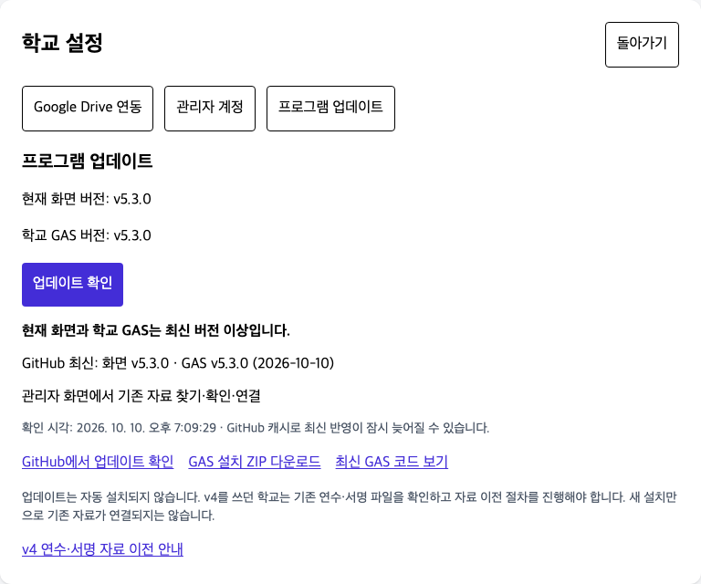

**사진에서 누를 곳: 업데이트 확인 / GAS 설치 ZIP 다운로드.** 업데이트 확인은 자동 설치가 아닙니다. GitHub를 읽을 수 없을 때의 오류를 최신 상태로 해석하지 않습니다.

**이 절차에서는 v4 이전 함수를 실행하지 않습니다.** 기존 스크립트 속성·파일 ID·Drive 파일·계정을 유지하면 다시 자료를 옮기거나 계정을 만들 필요가 없습니다.

## 11. 공용 도메인에서 이용하는 학교

학교 GAS /exec를 직접 사용하는 것이 기본 절차입니다. 공용 사이트를 이용하려면 먼저 해당 학교의 GAS 설치·자료 이전·관리자 설정을 끝냅니다.

1. [teachersign.skonvibe.com](https://teachersign.skonvibe.com)을 엽니다. ‘학교 연결’ 화면에서 학교의 실제 **/exec 주소**를 입력하고 **학교 연결**을 누릅니다.
2. 이미 학교가 연결된 경우 로그인 화면이 나올 수 있습니다. 관리자 로그인 후 **서버 연결 설정 → Google Drive 연동**에서 **학교 접속 링크**가 본인 학교인지 확인합니다.
3. 동일한 학교 관리자 계정과 Drive 자료를 사용합니다. 공용 사이트에서 발급한 연수 QR에는 도메인과 학교 GAS 주소가 함께 포함됩니다.

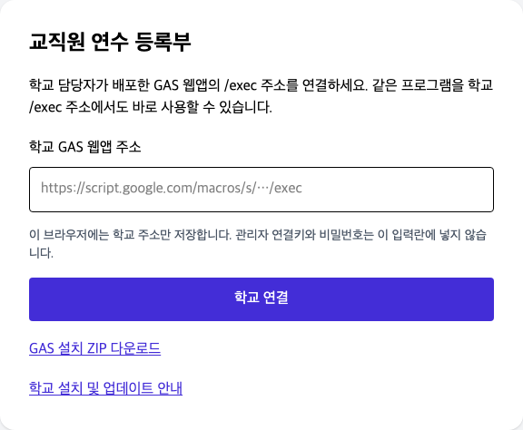

**정상 결과:** URL의 endpoint에는 학교 /exec 주소가 인코딩되어 있습니다. 이 링크는 별도 DB를 뜻하지 않습니다. 로그인 계정과 자료는 학교 GAS/Drive가 관리합니다.

| 수정한 부분 | 갱신할 곳 |
| --- | --- |
| 학교 GAS의 서버 처리만 수정, 기존 요청 형식 유지 | 학교 GAS 코드와 기존 배포 |
| 학교 /exec 화면 수정 | 학교 Index HTML과 기존 배포 |
| 공용 도메인의 화면 수정 | 공용 사이트 운영자의 사이트 배포 |
| 요청 형식 변경 | 학교 GAS와 사용하는 화면 양쪽 |

이 공용 도메인은 Cloudflare에서 운영합니다. 일반 학교 담당자는 Cloudflare나 Vercel 계정에 로그인할 필요가 없습니다. 이전 v4 공용 화면과 v5 GAS는 요청 방식이 달라 ERR-ACTION 오류가 날 수 있어 운영자가 공용 화면도 맞춰야 합니다.

## 12. 막혔을 때: 증상별 확인

| 증상 | 먼저 확인할 것 |
| --- | --- |
| /exec에 상태 JSON만 나옴 | 주소의 action=healthCheck 여부와 배포 버전. 일반 화면은 쿼리 없는 /exec, 건강 확인 JSON은 /exec?action=healthCheck |
| 함수 없음 / setupTeacherSign만 없음 | Code.gs 전체 교체·저장·새로고침, 최신 ZIP 여부. setupTeacherSign_이 아닌 setupTeacherSign 선택 |
| 새 설치인데 로그인 입력만 나옴 | 이미 계정이 있는 프로젝트인지 확인. 공통 기본 계정 없음. 새 계정을 만들려고 기존 계정을 지우지 않기 |
| 업데이트 후 연수 목록이 비어 있음 | 올바른 학교 endpoint·Google 계정·원본 DB와 현재 파일 비교. v4 학교는 8번 |
| ERR-ACTION / ERR-VERSION | 현재 화면과 GAS 버전·기존 배포 갱신 확인. 공용 도메인은 운영자의 화면 갱신도 확인 |
| ERR-GAS / 권한·접근 오류 | /exec 공개 접근, 실행 사용자 나, 원본 보관 계정, 최신 코드의 새 버전 배포 |
| 서명 참여자가 로그인 화면을 봄 | 관리자용 학교 링크가 아닌 해당 연수의 링크 공유에서 다시 만든 QR로 접속 |
| 설치 계정 확인·userinfo.email 권한 오류 | 설치 담당자 계정으로 실행, 직접 지정한 oauthScopes는 최신 매니페스트 반영, 권한 재승인 |

| 자료 이전 오류 | 조치 |
| --- | --- |
| ERR-MIGRATION-SOURCE | 원본 JSON ID·서명 시트 ID·NONE 선택 확인. 현재 파일을 원본으로 선택하지 않기 |
| ERR-MIGRATION-NOT-EMPTY | 현재 v5에 자료 있음. 삭제하지 말고 두 자료 보존 후 별도 병합 |
| ERR-MIGRATION-SHEET | 같은 학교·같은 원본 묶음인지, signatures 탭·열 구조 확인 |
| ERR-MIGRATION-PREVIEW | 원본/현재 상태 변경. previewTeacherSignMigration 다시 실행·개수 확인 |
| ERR-MIGRATION-COPY | 복사 검증 실패로 연결 유지. 원본과 로그를 보존하여 확인 |
| ERR-MIGRATION-DONE | 이미 이전한 프로젝트. 반복 이전하지 않고 현재 연결과 자료 확인 |
| ERR-MIGRATION-DB / FILE | JSON 구조·중복 ID·휴지통·25MB 제한 확인. 파일을 임의 수정하지 않기 |

문의 시 프로그램 버전, 오류 문구, 학교 /exec 주소, 편집기 주소와 원본 파일 ID를 전달하면 원인 확인에 도움이 됩니다. **관리자 연결키·암호·실제 명단·서명 이미지를 공개 게시하지 않습니다.** 스크린샷에 속성 값이 보이면 가려서 전달합니다.

## 13. 담당자 완료 점검과 인수인계

- 학교 운영 계정과 GAS 편집기 주소를 기록했습니다.
- 새 설치 / v4 최초 이전 / v5 일반 업데이트 중 맞는 절차를 사용했습니다.
- Code.gs와 Index HTML을 함께 저장하고 사용 중인 웹앱을 새 버전으로 배포했습니다.
- 일반 /exec에서는 최초 설정 또는 로그인 화면이 열립니다.
- 기존 학교의 최근·과거 연수, 명단, 서명 이미지, 내보내기를 확인했습니다.
- 가상 자료로 휴대폰의 관리자 로그인 없는 QR 서명을 시험했습니다.
- 일반 참여자에게 관리자 연결키·암호를 공유하지 않았습니다.
- 관리자용 학교 링크와 연수별 참여자 QR을 구분해 안내했습니다.
- 로그아웃 처리 표시와 로그인 화면 전환을 확인했습니다.
- v4 이전 학교는 원본·복사본·백업과 이전 완료 기록을 보관했습니다.

담당자용 비공개 기록에는 운영 계정, 편집기 주소, /exec 주소, 프로그램 버전, 마지막 업데이트 날짜, 이전 여부, 백업 위치를 적습니다. 관리자 암호와 연결키는 학교의 안전한 방법으로 인계하고 공개 문서에는 적지 않습니다. 웹앱 실행 계정의 소유권·조직을 바꾸는 경우 기존 배포가 계속 동작하는지 별도 확인합니다.

## 14. 자료 이전 후: 수동 백업하기

**현재 앱에는 전체 백업·복원 버튼이 없습니다.** Google Drive에서 현재 사용 중인 자료의 사본을 만들 수 있습니다. 이전 도구의 백업은 이전 시점의 자료이므로 이후 새 연수·서명은 따로 백업합니다.

1. **새 연수 등록·서명 입력이 없는 시간**에 진행합니다. Drive에 **TeacherSign_백업_날짜** 폴더를 만듭니다.
2. **Apps Script 왼쪽 톱니바퀴 → 스크립트 속성**에서 아래 값을 확인합니다. `https://drive.google.com/file/d/파일ID/view`의 `파일ID` 자리에 해당 값을 넣어 파일을 엽니다. 이름이 같은 파일이 있어도 **현재 연결된 ID**를 기준으로 고릅니다.

| 속성 이름 | 백업할 파일 |
| --- | --- |
| TEACHERSIGN_DB_FILE_ID | TrainingApp_DB.json · 연수 정보·연수별 명단·일부 기존 서명 |
| TEACHERSIGN_SIGNATURE_FILE_ID | TrainingApp_Signatures · 별도 저장된 서명 |

3. Drive에서 두 파일 각각 **우클릭 → 사본 만들기**를 합니다. 서명 시트에서는 **파일 → 사본 만들기**도 사용할 수 있습니다. 사본을 위 백업 폴더에 모으고 **원래 이름_백업_날짜**로 이름을 붙입니다.
4. 백업 폴더에 **두 사본이 모두 있는지**, 서명 시트 사본의 `signatures` 탭과 행이 유지됐는지 확인합니다. 백업 날짜와 두 사본의 공유 링크를 담당자 비공개 기록에 적고 정상 운영을 재개합니다.

**연수 JSON과 서명 시트를 한 묶음으로 보관하세요.** PDF 등록부는 출력용이며 프로그램에 다시 연결하는 원본 자료를 대신하지 않습니다. 백업용 서명 시트는 Google 스프레드시트 사본으로 보관합니다.

학교 설정·관리자 계정까지 보관하려면 `TEACHERSIGN_AUTH_FILE_ID`가 가리키는 **TeacherSign_Auth.json**도 같은 시점의 사본으로 만들고, 현재 Code.gs·Index HTML·스크립트 속성을 담당자만 접근하는 곳에 보관합니다. 계정 파일과 속성에는 인증 정보가 있으므로 공개 공유하지 않습니다. 새 명단 업로드에 쓰는 Excel 원본도 함께 보관하세요.

**복원은 백업 파일을 만들었다고 자동으로 되지 않습니다.** 두 자료의 날짜와 내용을 확인한 뒤 연결을 복구해야 합니다. 현재 자료를 덮어쓰거나 파일 ID·계정 파일을 임의 교체하지 말고 담당자에게 확인을 요청하세요.

Drive의 사본 만들기·다운로드 동작은 [Google 파일 안내](https://support.google.com/drive/answer/2423534?hl=ko), [Google 문서·시트 사본 안내](https://support.google.com/docs/answer/49114?hl=ko)에서 확인할 수 있습니다.

이 매뉴얼은 v5.2.1 구현과 실제 한국어 Google 메뉴를 대조했습니다. Google 권한 승인 화면은 계정마다 달라지는 관계로 공통 승인 흐름을 글로 설명했습니다. 인터넷 없이 열리는 HTML과 인쇄용 PDF에 실제 메뉴 사진과 가상 프로그램 화면을 제공합니다.

공식 동작 확인 자료: [Google 웹앱 배포 안내](https://developers.google.com/apps-script/guides/web), [Google 기존 배포 수정 안내](https://developers.google.com/apps-script/concepts/deployments), [프로그램 원본과 릴리스](https://github.com/skonT151216/teachersign-improved/releases).
