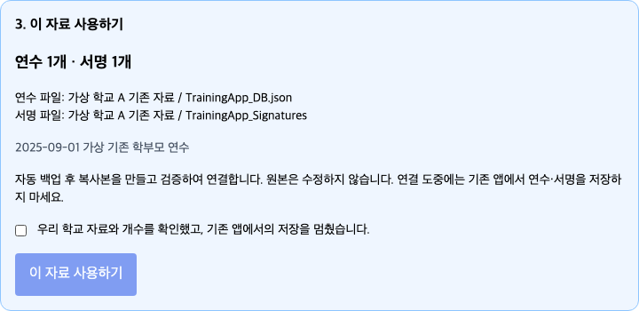

# v4 자료 이전 · 핵심 세 단계

다운로드 없이 이 페이지에서 바로 읽을 수 있습니다. 인쇄하려면 [한 장 PDF 다운로드](https://github.com/skonT151216/teachersign-improved/releases/latest/download/TeacherSign-Migration-Quick.pdf)를 이용하세요.

**v4 자료를 처음 연결할 때만 합니다. 이미 연수·서명이 잘 보이면 건너뛰세요.** 먼저 같은 Apps Script 프로젝트의 **Code.gs와 Index.html을 최신 파일로 교체**하고, 필요한 권한을 승인한 뒤 **기존 웹앱을 새 버전으로 배포**합니다. 파일 교체는 2번, 준비 실행은 3번, 배포 사진은 9번을 참고하세요. 기존 자료를 보관한 Google 계정을 사용합니다.

/exec 또는 학교 GAS를 연결한 공용 사이트에서 **관리자 로그인 → 서버 연결 설정 → Google Drive 연동 → 기존 자료 연결**을 엽니다. 최초 관리자 설정이 나오면 5번대로 계정을 만든 뒤 로그인하세요.

1. **기존 파일 찾기**를 누릅니다. Drive에 있는 기존 연수 파일과 서명 파일이 표시됩니다.
2. **우리 학교 자료를 선택하고 ‘선택한 자료 확인’**을 누릅니다. 폴더·연수 제목·연수 개수를 확인하세요. 별도 서명 파일이 있으면 함께 선택합니다. JSON 안에 모든 서명이 있을 때만 **별도 서명 파일 없음**을 고릅니다.
3. **연수·서명 개수가 맞는지 확인하고 ‘이 자료 사용하기’**를 누릅니다. 확인 체크를 먼저 합니다. **연결 완료 → 연수 목록 확인**으로 돌아가 내용을 확인하고 새 QR·서명 링크를 배포합니다.

**백업·복사·검증·연결은 프로그램이 처리하고 원본은 보존합니다.** 파일 ID를 입력하거나 이전 함수를 실행할 필요가 없습니다. 같은 사람의 서명이 JSON과 시트에 함께 있으면 한 번만 계산합니다.

**연결 중에는 기존 앱의 연수·서명 저장을 멈춥니다.** 현재 v5 자료가 있거나 원본·연결이 바뀌면 덮어쓰지 않고 중단합니다. 파일을 못 찾거나 오류가 나면 자료를 지우지 말고 오류 문구를 담당자에게 전달하세요. 이미 연결 완료한 학교는 반복 이전하지 않습니다.

[파일 이름이 바뀌었거나 담당자 도움이 필요할 때만 상세 안내](https://github.com/skonT151216/teachersign-improved/blob/main/gas/standalone/v4자료이전.md)

[전체 사진 매뉴얼 보기 — 파일 교체는 2번, 관리자 설정은 5번, 배포 사진은 9번](https://github.com/skonT151216/teachersign-improved/blob/main/docs/교사용매뉴얼.md)
